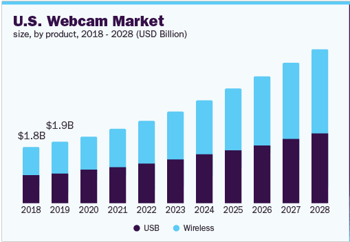
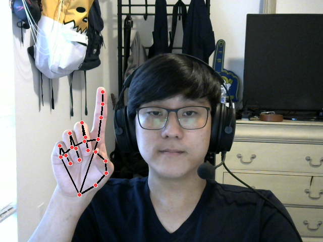
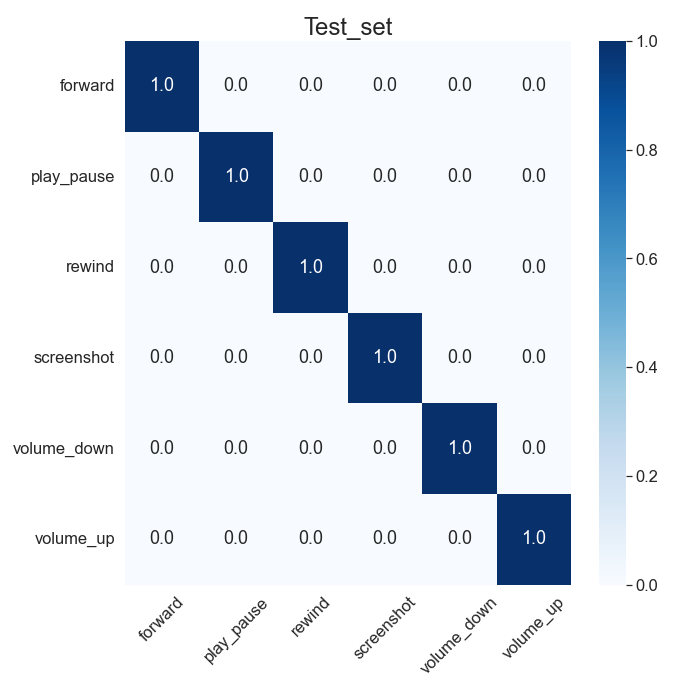
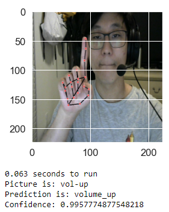
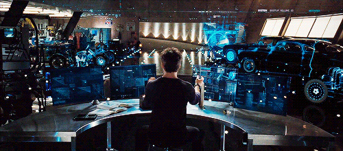

# Gesture Control Project
##### Thomaz Moon
---
## Table of Content
1. [Problem Statement](#prob)
1. [Executive Summary](#sum)
1. [The Process](#process)
  1. [Collecting the Data](#collect)
  1. [Building a Model](#model)
  1. [Testing The Model](#test)
1. [Conclusions](#conclusions)
1. [Moving Forward](#forward)
1. [Sources](#sources)

## Problem Statement
During the pandemic because a lot more people have started working from home and classes were held online, the number of people who own or use a webcam has grown, and according to [GrandViewResearch](https://www.grandviewresearch.com/industry-analysis/webcams-market), webcam demands and usage are expected to grow even more in the future.   

  

As part of Google's Development team **(hypothetically)**, I was tasked with creating a new feature utilizing webcams that Google could implement onto their many services they already offer. Additionally they would also like for it to primarily be made using products and resources offered by them to showcase what Google has to offer and is capable of.

## Executive Summary
Picture any of these scenarios:
* You're eating some hot wings and watching YouTube video on the computer, when you need to rewind and pause the video, but don't want to get your keyboard or mouse dirty.  
* Connecting your laptop to a tv with a very short HDMI cable and the couch 10 feet away. You don't have a wireless mouse and someone needs to walk up to the laptop in order to pause, play, rewind or fast forward.
* You have a certain habit, lets say scratching your head when working on something, but you often forget to save your work.
* You want to know what the next direction is on Google Maps but you can swipe your phone screen without reaching over in an unsafe manner.
* You're presenting via Google Slides but don't have a remote clicker to help you transition to new slides or go back. Or just want to have both hands free for dramatic effects and gestures

These are all problems that can be solved with simple hand gestures and a webcam (or phone camera) with this new API if backed by Google. Imagine with just the wave of your hand being able to rewind or fast forward a video, use an old habit to save documents automatically you might otherwise forget to save while working on it, swiping your fingers to see what your next direction on google maps will be, or set certain gestures to indicate to go to the next slide without the need of a presentation remote.  
Although for this project, I have focused on a video utilization aspect where a user can raise or lower the volume, play or pause and fast forward or rewind the video, and take a screenshot of the current screen. The success has shown that these things can easily be done and implemented, opening the door to the possibilities of gesture control for multiple areas.  

## The Process

**1. Collecting the Data** (Notebook/01_Collecting_images)  
Collecting the data was thankfully the easier part of this project as instead of having to scour the web for data compared to some other projects, the data this time is just pictures of ourselves in different hand poses. The two main libraries we use for this process is `OpenCv` which is used to access our webcam, and `MediaPipe` by Google which has a prebuilt model to find and draw a skeleton looking image onto our hand.  

For our purposes, I took around 150 images of each of the 6 poses to be used as part of our training/testing set. I also took an additional 2 - 3 images of each pose to be used as part of the validation set in order to test the model on brand new images not seen in either the training or testing set.  
I then went through each picture to make sure they were clear enough to be used to train the model. The pictures once `MediaPipe` is applied ended up looking like this  

**2. Building a Model** (Notebook/02_Training_The_Model)  
Building and training the model was the part that took the longest to do. In the notebook, I have only included my most successful model, however, I spent a minimum of 5 days on the modeling process building numerous models from scratch, but ultimately using a pretrained model offered by Keras called `MobileNet` to do transfer learning as it predicted images a lot faster, was smaller in size, and still had a great accuracy with little loss. If you would like to see some of the other models I tried, **[here](https://drive.google.com/file/d/1QhdZPJpYJ8YSL0VPdbk4H6YuBUI6JDgN/view?usp=sharing)** is a link to my Colab notebook I was training the model on, as Colab Pro offers more GPU space and ran much faster than on my local CPU.  

  
    

>In case you're unsure as to how to read this confusion matrix, the left is the actual class name, and the bottom is the predicted class. The 1.0 going down diagonally is showing that I had a 100% accuracy in predicting all the classes using the model.  

Although I had a number of models that were performing similarly, if not with better loss, the reason I ultimately ended up choosing `MobileNet` is because the speed at which it made predictions was around 0.068 seconds and my 2nd fastest model was at around 0.65 seconds almost 10 times slower resulting a very noticeable lag. Another contributing factor to use `MobileNet` was because it was considerably smaller being only 38MB vs my original model which was around 600mb.

  

One downside to using `MobileNet` however is the fact that it expects a square image, and one that isn't too high in resolution. Because my input shape was originally 480x640. I had to resize my image to be 224x224 (default size) which when viewed would lead to a significant resolution loss making this difficult to use from far away. However, as I am mostly testing this to be used on my computer where I won't be too far away it doesn't pose that significant an issue.

**3. Testing the Model** (Notebook/03_Testing_The_Model)  
Testing the model is fairly straight forward simply running the webcam along side a video shows that it works fairly well. The main function while it may look a bit confusing at first, is very similar to our notebook_1 in order to have similar inputs as our testing, however, the images getting passed in to the model are being resized to 224x224 as thats what the model was trained on and the input shape should match. The image being displayed to the user however is still in 480x640 to make things easier to read and see.  

An important feature about the main cell is `if action_seq[-1] == action_seq[-2] == action_seq[-3]:`. What this does is make sure that the last 3 predictions are all the same in order to not register a prediction one time and automatically do it. This not only helps with the speed at which things are done (such raising the volume, or starting and pausing the video  to quickly), but also ensures that even if there is 1 wrong prediction, it won't register as an action right away.

One more thing to note about the main code is that there is a sleep function of 0.1 seconds. This is there because it can take the model up to a 1/10 of a second to process the image and make a prediction, so in order to not cause lag and have the images keep piling on we will set a short sleep time of 0.1 seconds to give it time to process every frame coming in if there happens to be a hand on the screen.
In order to close the window made by OpenCV, simply press `q`

**See the final result in action**

## Conclusions
In conclusion, we have successfully created a model to correctly predict and do the actions that we want simply by making some simple hand gestures that our webcam can see. Although multiple models achieved an accuracy of 1.00, in the end `MobileNet` was chosen as the final model because it was able to not only achieve that 1.00 accuracy, but it also made predictions the quickest while also having the smallest file model. This not only leads to easier uploading onto github, but also means that even if someone were to not have a lot of free space left on their computer, they can easily download and run this.  

There might be more work to be done on this project, such as adding an another class called "ignore" which will just be used for miscellaneous hand gestures that might be done on accident, such as biting your nail or brushing your hair and should therefore not do anything accidentally. However, I'm fairly happy with the results of how this turned out and would like to say that this does seem like an achievable thing to implement to many things Google already owns.

## Moving Forward
For the future, I would like to expand on this idea and implement it onto many Google Products such as a gesture controlled google slides presentation, swiping to view next steps on google maps, gesture short cuts on google docs or spreadsheets and even gesture control pretrained for specific actions.  

Even further down, we should be able to even sell a special webcam in order to make a smart tv even smarter and add certain short cuts and controls with just some simple calibrations. The possibilities of gesture control for many things in the future, once the kinks are worked out, it almost seems as though just a part of Tony Stark's technology will be accessible to everyone.  

## Sources
1. [Noah Christiansen](https://www.linkedin.com/in/noah-christiansen/)
1. [General Ideas for Gesture Recognition](https://github.com/kairess/gesture-recognition)
1. [List of Keras Pretrained Models](https://keras.io/api/applications/)
1. [MediaPipe Hand Summary](https://google.github.io/mediapipe/images/mobile/hand_landmarks.png)
1. [Iron Man Gif](https://miro.medium.com/max/500/0*fYuuscQijhS0rCem.gif)
